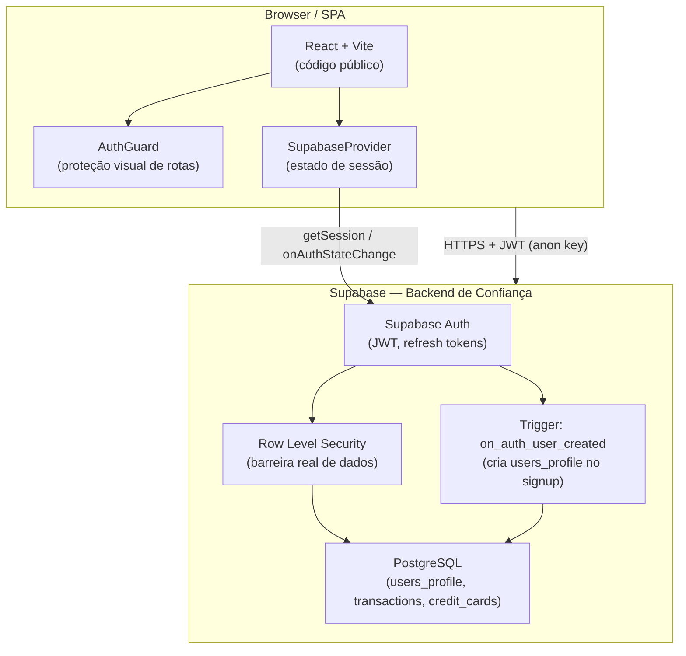

# Documentação de Arquitetura — Simple Finance

## Sumário

1. [Stack Tecnológico](#1-stack-tecnológico)
2. [Visão Geral do Sistema e Trust Boundaries](#2-visão-geral-do-sistema-e-trust-boundaries)
3. [Banco de Dados — Schema Atual](#3-banco-de-dados--schema-atual)
4. [Contrato de Dados por Tabela](#4-contrato-de-dados-por-tabela)
5. [Políticas de Segurança (RLS)](#5-políticas-de-segurança-rls)
6. [Regras de Negócio e Diretrizes para a IA](#6-regras-de-negócio-e-diretrizes-para-a-ia)
7. [Riscos e Operação](#7-riscos-e-operação)

---

## 1. Stack Tecnológico

| Camada | Tecnologia | Observação |
|---|---|---|
| Frontend | React 18 + Vite | SPA — todo código é público e inspecionável |
| Estilização | Tailwind CSS | Configurado em `tailwind.config.js` |
| Backend / BaaS | Supabase | PostgreSQL + Auth |
| Padrão de Qualidade | Regras de segurança e arquitetura definidas nas `user_rules` do Cursor (configuração local, fora do versionamento) | Não há `.cursorrules` nem `.cursor/rules/` no repositório |

> **Premissa fundamental:** Como o app é uma SPA client-side, todo código enviado ao browser é público. A segurança real é garantida exclusivamente pelo Supabase (Auth + RLS). O React gerencia apenas UX/estado local.

---

## 2. Visão Geral do Sistema e Trust Boundaries



**Regra de ouro:** O `AuthGuard` é uma barreira de UX, não de segurança. Qualquer requisição ao banco sem um JWT válido é bloqueada pelo RLS, independentemente do que o React renderiza ou não.

Para o fluxo completo de autenticação, ver [docs/docs_flow/auth.md](./auth.md).

---

## 3. Banco de Dados — Schema Atual

### Tabelas na base `public`

| Tabela | Descrição | FK principal | Migration versionada |
|---|---|---|---|
| `users_profile` | Perfil estendido do usuário | `id → auth.users` (cascade delete) | Sim |
| `transactions` | Lançamentos financeiros (entrada, saída, investimento) | `user_id → auth.users` | Não* |
| `credit_cards` | Cartões de crédito cadastrados pelo usuário | `user_id → auth.users` | Não* |

> *As tabelas `transactions` e `credit_cards` existem no Supabase (criadas e com RLS aplicado via SQL no painel), mas o DDL ainda **não está versionado** neste repositório. Isso não impede o funcionamento atual, mas significa que recriar o ambiente do zero exigiria aplicar esses scripts manualmente. Versionar as migrations é uma melhoria recomendada.

### Migrations versionadas

| Arquivo | O que aplica |
|---|---|
| `supabase/migrations/20260226000000_create_users_profile.sql` | Cria `users_profile` + RLS com 3 policies |
| `supabase/migrations/20260301000000_enable_profile_on_signup.sql` | Cria função `handle_new_user()` + trigger `on_auth_user_created` |

### Features de banco implementadas

- [x] **RLS ativado** em todas as tabelas — `users_profile` via migration versionada; `transactions` e `credit_cards` via SQL aplicado diretamente no painel do Supabase
- [x] **Search Path Hijacking protegido:** a função `handle_new_user()` usa `SET search_path = public` para evitar que schemas maliciosos sobreponham funções nativas
- [x] **RLS Performance Mode:** todas as policies utilizam a sintaxe otimizada `(select auth.uid())` para evitar reavaliação por linha, aplicado diretamente no painel do Supabase.
- [ ] **Double Verification na troca de e-mail** *(planejado):* fluxo atual não exige reautenticação antes de alterar o e-mail. Ver detalhes em [auth.md § Features Futuras](./auth.md#10-features-futuras-planejadas).

---

## 4. Contrato de Dados por Tabela

### `users_profile`

| Coluna | Tipo | Nullable | Descrição |
|---|---|---|---|
| `id` | `UUID` | NOT NULL (PK) | Espelha `auth.users.id`; cascade delete |
| `name` | `TEXT` | SIM | Nome de exibição. Populado via `raw_user_meta_data->>'full_name'` no signup |
| `email` | `TEXT` | NOT NULL | Espelha `auth.users.email`. Atualizado manualmente via `SettingsPage` |

### `transactions`

| Coluna | Tipo | Nullable | Descrição |
|---|---|---|---|
| `id` | `UUID` | NOT NULL (PK) | Gerado pelo Supabase |
| `user_id` | `UUID` | NOT NULL | FK para `auth.users` |
| `name` | `TEXT` | NOT NULL | Nome/descrição do lançamento |
| `date` | `DATE` | NOT NULL | Data do lançamento (formato `YYYY-MM-DD`) |
| `type` | `TEXT` | NOT NULL | Enum: `"entrada"` \| `"saida"` \| `"investimento"` |
| `category` | `TEXT` | NOT NULL | Categoria principal (ex: `"Alimentação"`, `"Salário"`) |
| `subcategory` | `TEXT` | SIM | Subcategoria; relevante apenas quando `type = "saida"` |
| `amount` | `NUMERIC` | NOT NULL | Valor em reais |
| `payment_method` | `TEXT` | SIM | `"Dinheiro"` \| `"Valor em conta"` \| `"Cartão de Crédito"` |
| `credit_card_id` | `UUID` | SIM | FK para `credit_cards`; preenchido apenas se `payment_method = "Cartão de Crédito"` |

### `credit_cards`

| Coluna | Tipo | Nullable | Descrição |
|---|---|---|---|
| `id` | `UUID` | NOT NULL (PK) | Gerado pelo Supabase |
| `user_id` | `UUID` | NOT NULL | FK para `auth.users` |
| `name` | `TEXT` | NOT NULL | Nome do cartão |
| `bank` | `TEXT` | NOT NULL | Nome do banco/emissor |
| `limit_amount` | `NUMERIC` | NOT NULL | Limite de crédito em reais |
| `due_day` | `INTEGER` | NOT NULL | Dia do mês de vencimento da fatura (1–31) |
| `closing_day` | `INTEGER` | NOT NULL | Dia do mês de fechamento da fatura (1–31) |

> **Regra de negócio:** O sistema aplica um limite de **3 cartões por usuário**, validado no front em `CreditCardsPage`. Recomenda-se adicionar uma `CHECK constraint` ou `trigger` no banco para garantir essa regra na camada de dados.

---

## 5. Políticas de Segurança (RLS)

O RLS garante que **nenhuma query no front-end consiga acessar ou modificar dados de outro usuário**, independentemente de qualquer lógica React.

#### `users_profile`

*Coluna de comparação: `id`*

| Operação | Nome da policy | Condição |
|---|---|---|
| SELECT | "Users can view own profile" | `(select auth.uid()) = id` |
| INSERT | "Users can insert own profile" | `(select auth.uid()) = id` |
| UPDATE | "Users can update own profile" | `(select auth.uid()) = id` |

#### `transactions`

*Coluna de comparação: `user_id`*

| Operação | Nome da policy |
|---|---|
| SELECT | "Ver próprias transações" |
| INSERT | "Criar próprias transações" |
| UPDATE | "Atualizar próprias transações" |
| DELETE | "Deletar próprias transações" |

#### `credit_cards`

*Coluna de comparação: `user_id`*

| Operação | Nome da policy |
|---|---|
| SELECT | "Ver próprios cartões" |
| INSERT | "Criar próprios cartões" |
| UPDATE | "Atualizar próprios cartões" |
| DELETE | "Deletar próprios cartões" |

---

## 6. Regras de Negócio e Diretrizes para a IA

### Padrão de RLS (obrigatório para novas tabelas)

Toda policy criada ou sugerida deve obrigatoriamente usar a sintaxe de alta performance com o wrapper `select`, para evitar reavaliação de `auth.uid()` por linha:

```sql
-- CORRETO (alta performance)
USING ((select auth.uid()) = user_id)
WITH CHECK ((select auth.uid()) = user_id)

-- INCORRETO (reavalia por linha — evitar)
USING (auth.uid() = user_id)
```

### Separação de responsabilidades (Security Model)

| Camada | Responsabilidade | O que NÃO deve fazer |
|---|---|---|
| React / Estado | UX, loading states, redirecionamento visual | Controle de acesso real a dados |
| Supabase Auth | Identidade, JWT, refresh tokens | — |
| RLS / PostgreSQL | Autorização real de leitura e escrita | — |

### Padrão de nomenclatura de policies

Ao criar novas tabelas, seguir o padrão:

```
"Ver próprias [entidade]"
"Criar próprias [entidade]"
"Atualizar próprias [entidade]"
"Deletar próprias [entidade]"
```

### Nunca colocar chaves privadas no front-end

A chave usada no front-end deve ser exclusivamente a `sb_publishable_*` (anon key). A `service_role` key bypassa o RLS e **nunca** pode aparecer em código React ou em variáveis `VITE_*`.

---

## 7. Riscos e Operação

### Riscos ativos

| Risco | Severidade | Status | Referência |
|---|---|---|---|
| Sessão JWT armazenada em `localStorage` (vulnerável a XSS) | Alta | Aceito — mitigado pelo refresh token rotativo do Supabase SDK | [auth.md § Segurança](./auth.md#9-segurança--pontos-de-atenção) |
| Troca de e-mail sem reautenticação (`SettingsPage`) | Alta | Planejado corrigir | [auth.md § Features Futuras](./auth.md#10-features-futuras-planejadas) |
| DDL de `transactions` e `credit_cards` não versionado no repo (aplicado via painel Supabase) | Baixa | Pendente versionar | — |
| Limite de 3 cartões validado apenas no front | Baixa | Pendente constraint no banco | — |

### Como investigar problemas

- **Erros de RLS (acesso negado):** verificar Logs → Database no painel do Supabase; erro típico é `42501 insufficient_privilege`
- **Problemas de sessão/auth:** verificar Logs → Auth no painel do Supabase
- **Performance de queries:** usar a aba SQL Editor → `EXPLAIN ANALYZE` para queries lentas; verificar se as policies estão usando o wrapper `select`
- **Trigger de signup falhou:** verificar se a linha em `users_profile` foi criada após o cadastro; se não, checar Logs → Database por erros da função `handle_new_user()`
