# Fluxo de Autenticação — Simple Finance

Documentação técnica completa do sistema de autenticação da aplicação, baseada em **React + Vite** com **Supabase Auth** como backend de identidade.

---

## Sumário

1. [Visão Geral da Arquitetura](#1-visão-geral-da-arquitetura)
2. [Mapa de Rotas](#2-mapa-de-rotas)
3. [Fluxo: Login](#3-fluxo-login)
4. [Fluxo: Cadastro (duas etapas)](#4-fluxo-cadastro-duas-etapas)
5. [Fluxo: Recuperação de Senha](#5-fluxo-recuperação-de-senha)
6. [Fluxo: Logout](#6-fluxo-logout)
7. [Fluxo: Configurações de Conta](#7-fluxo-configurações-de-conta)
8. [Banco de Dados](#8-banco-de-dados)
9. [Segurança — Pontos de Atenção](#9-segurança--pontos-de-atenção)
10. [Features Futuras Planejadas](#10-features-futuras-planejadas)

---

## 1. Visão Geral da Arquitetura

### Camadas do sistema de auth

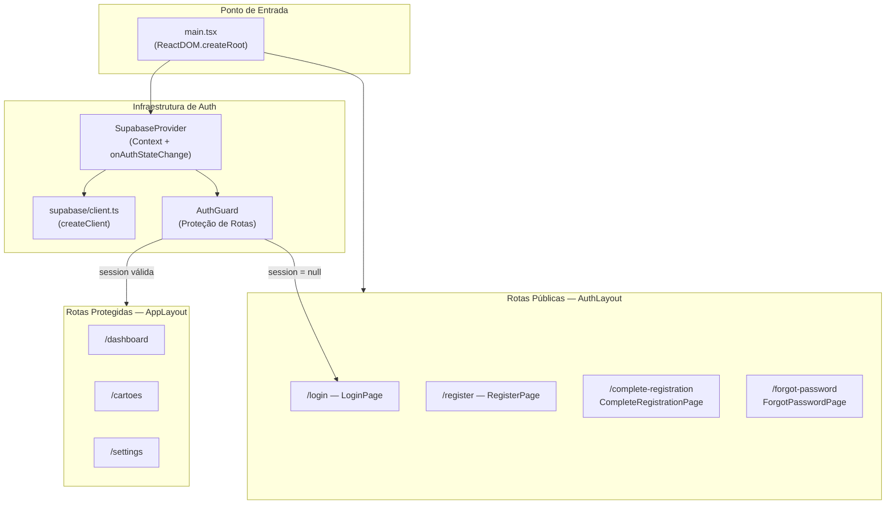

### Gerenciamento de sessão

O `SupabaseProvider` é o coração do estado de auth. Ele:

1. Na montagem, chama `supabase.auth.getSession()` para recuperar uma sessão persistida
2. Subscreve `onAuthStateChange` para reagir em tempo real a qualquer evento (login, logout, refresh de token)
3. Distribui `{ session, loading }` via React Context para toda a árvore de componentes
4. O hook `useSupabaseSession()` é o único ponto de consumo desse estado

```
localStorage (gerenciado pelo SDK Supabase)
    └── sb-<project>-auth-token  ← JWT de acesso + refresh token
```

> **Nota de segurança:** O SDK do Supabase armazena o JWT e o refresh token no `localStorage` automaticamente. Isso é conveniente (persiste entre abas e reloads), mas expõe o token a ataques XSS. Ver [Seção 9](#9-segurança--pontos-de-atenção).

### Arquivos principais

| Arquivo | Responsabilidade |
|---|---|
| `src/supabase/client.ts` | Instancia o cliente Supabase com a chave pública |
| `src/supabase/SupabaseProvider.tsx` | Context global de sessão + listener de eventos |
| `src/supabase/AuthGuard.tsx` | Protetor visual de rotas privadas |
| `src/main.tsx` | Definição de todas as rotas da aplicação |

---

## 2. Mapa de Rotas

| Rota | Componente | Tipo | Comportamento |
|---|---|---|---|
| `/login` | `LoginPage` | Pública | Formulário de login |
| `/register` | `RegisterPage` | Pública | Início do cadastro (email-link) |
| `/complete-registration` | `CompleteRegistrationPage` | Pública* | Definição de senha pós-confirmação de email |
| `/forgot-password` | `ForgotPasswordPage` | Pública | Recuperação/redefinição de senha |
| `/` | — | Protegida | Redireciona para `/dashboard` |
| `/dashboard` | `DashboardPage` | Protegida | Painel principal |
| `/cartoes` | `CreditCardsPage` | Protegida | Gestão de cartões de crédito |
| `/settings` | `SettingsPage` | Protegida | Configurações de conta |
| `*` | — | — | Redireciona para `/login` |

> *`/complete-registration` é tecnicamente pública no roteador, mas redireciona via `useEffect` se não houver sessão ou se o flag `needs_password_set` for `false`.

---

## 3. Fluxo: Login

**Arquivo:** `src/ui/pages/auth/LoginPage.tsx`
**Método Supabase:** `supabase.auth.signInWithPassword`

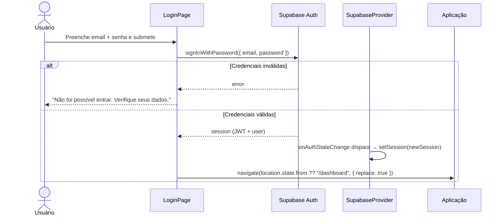

**Detalhes de implementação:**
- A mensagem de erro é **genérica** e não expõe se o email ou a senha está errado — boa prática de segurança (evita enumeração de usuários)
- Após login bem-sucedido, o redirecionamento respeita a rota original que o usuário tentava acessar, salva em `location.state.from` pelo `AuthGuard`

---

## 4. Fluxo: Cadastro (duas etapas)

**Arquivos:** `src/ui/pages/auth/RegisterPage.tsx` e `src/ui/pages/auth/CompleteRegistrationPage.tsx`

O cadastro é dividido em duas etapas para garantir que o email do usuário seja verificado antes de criar a senha definitiva.

### Etapa 1 — Solicitação de cadastro

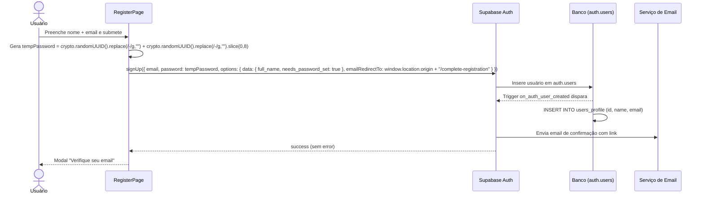

**Sobre a senha temporária:**
- Gerada com dois `crypto.randomUUID()` concatenados sem os hífens — nunca é exibida ao usuário
- Serve apenas para satisfazer o requisito de senha do Supabase Auth no `signUp`
- Será substituída pela senha real na Etapa 2
- O flag `needs_password_set: true` em `user_metadata` sinaliza que o cadastro está incompleto

### Etapa 2 — Confirmação e criação de senha

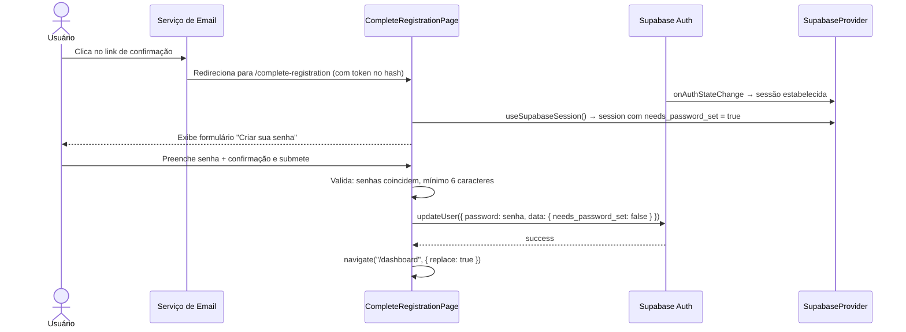

**Proteções no `CompleteRegistrationPage`:**
- Se `authLoading = true`: exibe spinner
- Se `session = null`: redireciona para `/login`
- Se `session.user.user_metadata.needs_password_set = false`: redireciona para `/dashboard`
- Apenas exibe o formulário se a sessão existe E o flag está `true`

---

## 5. Fluxo: Recuperação de Senha

**Arquivo:** `src/ui/pages/auth/ForgotPasswordPage.tsx`

A página gerencia dois estados internos com um único componente, controlados pela variável `step: "email" | "reset"`.

### Detecção do modo (`isRecoveryFlow`)

```typescript
function isRecoveryFlow(): boolean {
  return window.location.hash.includes("type=recovery");
}

const [step, setStep] = useState<"email" | "reset">(() =>
  isRecoveryFlow() ? "reset" : "email"
);
```

O `step` inicial é determinado **uma única vez** na montagem do componente, via função de inicialização do `useState`. Se o hash da URL contiver `type=recovery`, o componente abre diretamente no formulário de redefinição.

### Step 1 — Solicitação de email de recuperação

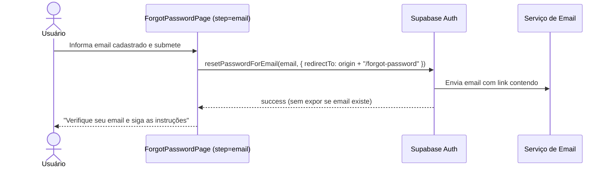

### Step 2 — Redefinição da senha

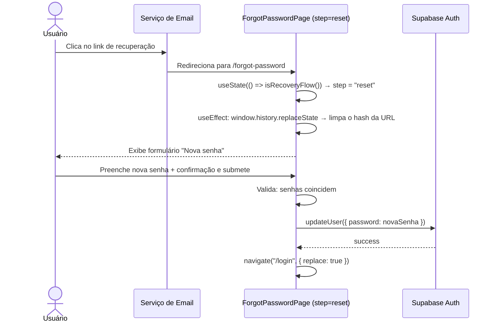

> **Limitação conhecida:** A detecção de `type=recovery` via `window.location.hash` é calculada apenas no `useState` inicial. Se o componente já estiver montado quando a navegação ocorrer (por ser uma SPA), o `useEffect` não recalcularia o step. Uma alternativa mais robusta seria usar `supabase.auth.onAuthStateChange` com o evento `PASSWORD_RECOVERY`.

---

## 6. Fluxo: Logout

**Arquivo:** `src/ui/layouts/AppLayout.tsx`
**Método Supabase:** `supabase.auth.signOut`

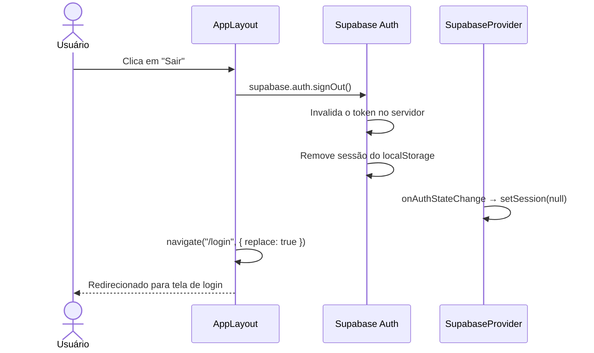

---

## 7. Fluxo: Configurações de Conta

**Arquivo:** `src/ui/pages/settings/SettingsPage.tsx`

A página contém três formulários independentes.

### Carregamento inicial de dados

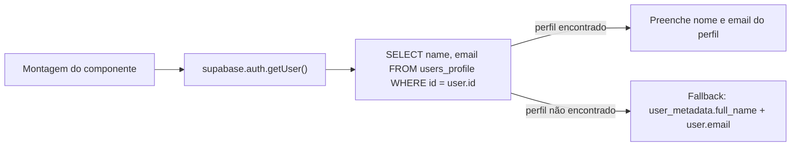

### Alterar nome

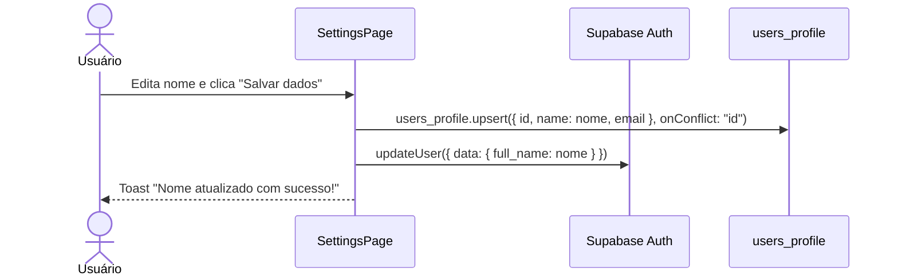

### Alterar email

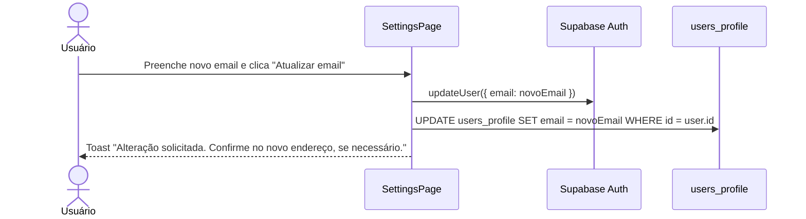

> **Atenção de segurança:** Este fluxo **não exige re-autenticação** (senha atual) antes de solicitar a troca de email. Isso é uma vulnerabilidade conhecida — um atacante com sessão ativa (ex: XSS) poderia redirecionar o email da conta. Ver [Seção 9](#9-segurança--pontos-de-atenção).

### Alterar senha

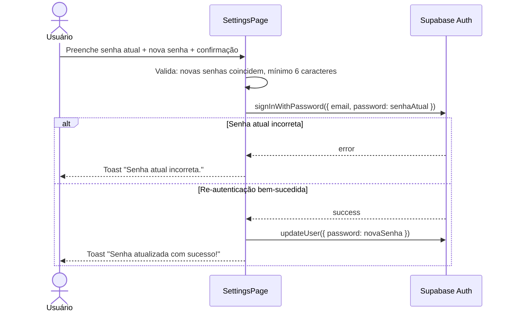

A re-autenticação com `signInWithPassword` antes de alterar a senha é um padrão de segurança correto.

---

## 8. Banco de Dados

### Tabela `public.users_profile`

```sql
CREATE TABLE IF NOT EXISTS public.users_profile (
  id    UUID PRIMARY KEY REFERENCES auth.users(id) ON DELETE CASCADE,
  name  TEXT,
  email TEXT NOT NULL
);
```

| Coluna | Tipo | Descrição |
|---|---|---|
| `id` | `UUID` | PK — espelha `auth.users.id` (cascade delete) |
| `name` | `TEXT` | Nome de exibição do usuário (pode ser nulo) |
| `email` | `TEXT NOT NULL` | Email sincronizado com `auth.users.email` |

### Row Level Security (RLS)

```sql
ALTER TABLE public.users_profile ENABLE ROW LEVEL SECURITY;

-- SELECT: apenas o próprio usuário
CREATE POLICY "Users can view own profile"
  ON public.users_profile FOR SELECT
  USING ((select auth.uid()) = id);

-- UPDATE: apenas o próprio usuário
CREATE POLICY "Users can update own profile"
  ON public.users_profile FOR UPDATE
  USING ((select auth.uid()) = id);

-- INSERT: apenas o próprio usuário
CREATE POLICY "Users can insert own profile"
  ON public.users_profile FOR INSERT
  WITH CHECK ((select auth.uid()) = id);
```

O RLS garante que nenhum usuário consiga ler ou modificar o perfil de outro, independentemente de qualquer lógica no front-end.

### Trigger `on_auth_user_created`

Criado na migration `20260301000000_enable_profile_on_signup.sql`:

```sql
CREATE OR REPLACE FUNCTION public.handle_new_user()
RETURNS TRIGGER
LANGUAGE plpgsql
SECURITY DEFINER
SET search_path = public
AS $$
BEGIN
  INSERT INTO public.users_profile (id, name, email)
  VALUES (
    NEW.id,
    COALESCE(NEW.raw_user_meta_data->>'full_name', ''),
    COALESCE(NEW.email, '')
  );
  RETURN NEW;
END;
$$;

CREATE TRIGGER on_auth_user_created
  AFTER INSERT ON auth.users
  FOR EACH ROW
  EXECUTE FUNCTION public.handle_new_user();
```

**O que faz:** Toda vez que um usuário é inserido em `auth.users` (via `signUp`), o trigger cria automaticamente uma linha correspondente em `users_profile`, populando `name` com `raw_user_meta_data->>'full_name'` e `email` com o email do cadastro.

### Migrations aplicadas

| Arquivo | O que faz |
|---|---|
| `20260226000000_create_users_profile.sql` | Cria a tabela `users_profile` e configura as 3 policies de RLS |
| `20260301000000_enable_profile_on_signup.sql` | Cria a função `handle_new_user` e o trigger `on_auth_user_created` |

---

## 9. Segurança — Pontos de Atenção

### AuthGuard é apenas visual

O `AuthGuard` em `src/supabase/AuthGuard.tsx` **não é uma barreira de segurança real**. Ele protege apenas a renderização dos componentes no front-end. A verdadeira proteção é o RLS no Supabase — qualquer query que chegue ao banco sem um JWT válido será bloqueada pelas policies.

```
// Nota: Isso é apenas visual.
// A API (Supabase RLS) bloqueia a requisição real independentemente deste guard.
if (!session) {
  return <Navigate to="/login" ... />;
}
```

### Sessão no `localStorage`

O SDK do Supabase armazena o JWT e o refresh token no `localStorage` por padrão. Isso implica:

- **Risco:** Um ataque XSS bem-sucedido pode roubar o token de acesso
- **Mitigação atual:** O Supabase usa refresh tokens com rotação automática; o JWT de acesso tem vida curta
- **Alternativa ideal:** Cookies `HttpOnly; Secure; SameSite=Strict` — não acessíveis via JavaScript, mas requerem um servidor intermediário (BFF/proxy)

### Troca de email sem re-autenticação

O `handleAlterarEmail` em `SettingsPage` chama `supabase.auth.updateUser({ email })` diretamente, sem verificar a senha atual. Um atacante com acesso à sessão ativa (por XSS ou sessão não encerrada em dispositivo compartilhado) poderia redirecionar o email da conta para um endereço sob seu controle, assumindo a conta.

**Status:** Vulnerabilidade conhecida. Pendente de implementação — ver [Seção 10](#10-features-futuras-planejadas).

### Detecção de recovery flow via hash

A detecção de `type=recovery` na `ForgotPasswordPage` depende de `window.location.hash` ser avaliado no momento da montagem inicial do componente. Em cenários de navegação SPA (se o componente já estiver montado no cache), o hash pode não ser reavaliado.

**Alternativa recomendada:**

```typescript
supabase.auth.onAuthStateChange((event) => {
  if (event === "PASSWORD_RECOVERY") {
    setStep("reset");
  }
});
```

### Chave pública no front-end

```typescript
// src/supabase/client.ts
const supabaseKey = "sb_publishable_E0Raz_pMpACG-PfqjIrVFw_2CMjJYYL";
```

A chave utilizada é do tipo `sb_publishable_*` — a **anon/publishable key**, projetada para uso no front-end. Ela tem permissões limitadas pelo RLS e **não é uma chave de service role**. Isso está correto e seguro para o ambiente client-side.

> **Regra de segurança absoluta:** A `service_role` key (que bypassa o RLS) **nunca** deve aparecer no código React ou em variáveis `VITE_*`. Se necessária, deve existir apenas em um servidor/edge function.

---

## 10. Features Futuras Planejadas

### Alteração de email com dupla verificação

**Problema que resolve:** O fluxo atual de troca de email não exige re-autenticação, criando uma janela de vulnerabilidade para sequestro de conta.

**Solução proposta (Double Verification):**

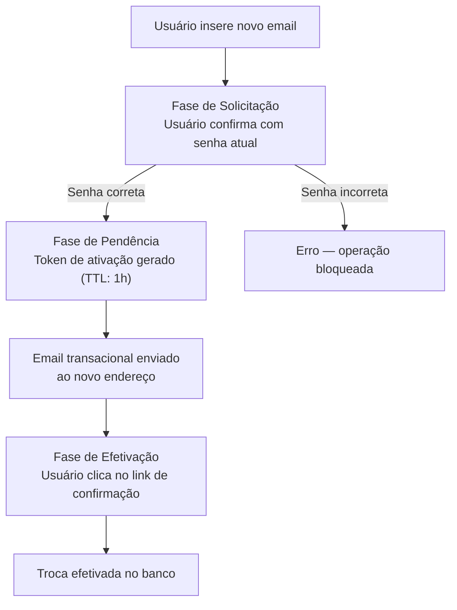

**Impactos no sistema:**
- **Frontend:** Adicionar campo "Senha atual" no formulário de troca de email em `SettingsPage`; feedback visual para estado pendente de confirmação
- **Segurança:** Proteção contra força bruta no campo de senha; invalidação de tokens expirados
- **Riscos a tratar:** Conflito de email (novo email já cadastrado, sem expor dados de terceiros) e entregabilidade do email de confirmação
